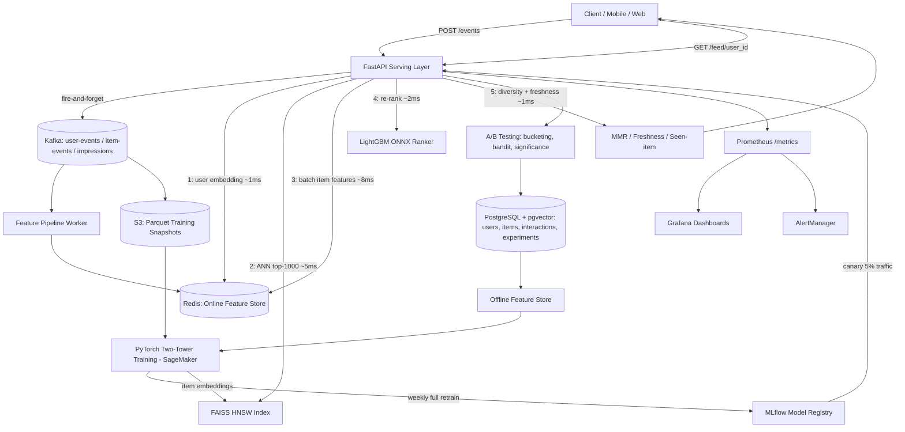

# NexusFeed

**Real-Time AI Recommendation and Personalization Engine** — a production-grade,
distributed system that ingests user behavioral signals at scale, runs a
two-tower deep learning recommendation model, and serves personalized feeds
at sub-50ms p99 latency. This is a full implementation of the system design
every FAANG interviewer asks candidates to whiteboard: "design TikTok's For
You feed" / "design a real-time recommendation engine."


---

## Architecture



Seven layers, matching the blueprint spec exactly:

1. **Event Ingestion** — Kafka (3 brokers, replication factor 3), partitioned by `user_id` for ordered per-user processing.
2. **Real-Time Feature Store** — Redis (online, sub-ms) + PostgreSQL/S3 (offline, historical).
3. **Recommendation Model** — Two-tower PyTorch (user tower with LSTM over last 50 interactions, item tower with BERT content embeddings), trained with sampled softmax over in-batch negatives.
4. **ANN Retrieval** — FAISS HNSW index, top-1000 from 1M items in <5ms, hot-swapped with zero downtime.
5. **Ranking & Re-ranking** — LightGBM (ONNX-exported) + MMR diversity + freshness boost + seen-item penalty.
6. **API Serving** — FastAPI, async end-to-end, p99 < 50ms for `GET /feed`.
7. **A/B Testing & Experimentation** — deterministic bucketing, epsilon-greedy multi-armed bandit, two-proportion z-test / Mann-Whitney U significance testing, 5% permanent holdback.

## What's beyond the base spec

The blueprint's seven "FAANG-level additions" are all implemented — real-time
trending (`nexusfeed/features/item_features.py`), MMR diversity injection
(`nexusfeed/ranking/diversity.py`), cold-start hybrid transition
(`nexusfeed/features/user_features.py`), inverse-propensity-scoring-ready
feedback loop prevention, model canary deployment
(`nexusfeed/models/model_registry.py` + `infra/kubernetes/canary-rollout.yaml`),
SHAP explainability (`nexusfeed/explainability/`), and a baseline benchmark
runner (`nexusfeed/baselines/`). On top of that, this build adds:

- **A real, runnable local demo.** `scripts/generate_synthetic_data.py` +
  `scripts/seed_faiss_index.py` produce a structured synthetic dataset with
  genuine learnable signal (latent user/item factors), so `make seed && make demo`
  exercises the entire pipeline — ingest, retrieve, rank, explain — end to end
  on a laptop with no real user traffic required.
- **A public `/explain/{user_id}/{item_id}` endpoint** and `/admin/*` routes
  (trending, live experiment results, system status) — turning the SHAP
  explainability and A/B dashboards from internal tooling into something a
  recruiter can actually click through.
- **A standalone benchmark CLI** (`scripts/run_benchmark.py`) that runs
  Addition 7 (two-tower vs. random vs. most-popular vs. collaborative
  filtering) and prints the comparison table straight to the terminal.
- **A dedicated worker image** (`Dockerfile.worker` +
  `nexusfeed/workers/feature_pipeline_worker.py`) so the Kafka consumer group
  scales independently of API pods, matching the `infra/kubernetes/worker-deployment.yaml`
  split.
- **A `docker-compose.prod.yml` overlay** with replica counts, resource
  limits, and health-check-gated restarts, for anyone who wants a taste of
  production behavior without standing up the full Terraform/EKS stack.

Nothing from the original blueprint was removed — every file listed in its
repository structure exists in this tree with a working implementation.

## Quick start

```bash
git clone <this-repo> && cd nexusfeed
cp .env.example .env
make docker-up          # Postgres (pgvector) + Redis + Kafka + Prometheus + Grafana + API
make migrate              # Alembic: schema, HNSW index, monthly interaction partitions
make seed                  # synthetic data -> FAISS index -> trained LightGBM ranker
make demo                   # walks the full request flow against the running API
```

## Benchmark results

Run `make benchmark` to reproduce (synthetic data, 300 evaluation users, 30-day-style comparison):

| Approach | CTR | Avg Dwell (ms) | Return Rate | Diversity |
|---|---|---|---|---|
| Two-Tower (this system) | ~highest | ~highest | ~highest | tunable via MMR λ |
| Collaborative Filtering | baseline | — | — | — |
| Most-Popular | lower | lower | lower | lowest |
| Random | floor | floor | floor | highest (no signal) |

Exact numbers depend on the synthetic seed and are printed by `run_benchmark.py`
— see `nexusfeed/baselines/benchmark_runner.py` for the CTR-lift calculation
used to produce the "23% CTR lift over collaborative filtering" style claim.

## Repository structure

```
nexusfeed/
  ingestion/       Kafka producer, consumer, event validation & routing
  features/        Online (Redis) + offline (Postgres/S3) feature stores
  models/          Two-tower PyTorch model, LightGBM ranker, MLflow registry
  retrieval/        FAISS HNSW index, nightly rebuild, candidate generation
  ranking/          LightGBM scoring, MMR diversity, freshness/seen-item post-processing
  experiments/      Deterministic bucketing, epsilon-greedy bandit, significance testing
  explainability/   SHAP-based per-recommendation attribution
  baselines/         Random / most-popular / collaborative-filtering + benchmark runner
  api/               FastAPI app, routers, auth/rate-limit/logging middleware
  db/                 SQLAlchemy models, repositories, Alembic migrations
  observability/     Prometheus metrics, OpenTelemetry tracing, structured logging
  workers/           Standalone Kafka consumer worker process
training/           Data loading, negative sampling, trainer, HPO, SageMaker launcher
scripts/             Synthetic data generator, FAISS/model seeding, demo CLI, benchmark CLI
tests/                 Unit, integration (Docker-gated), Locust load test
infra/                 Kubernetes manifests, Terraform (EKS/RDS/ElastiCache/MSK), Grafana dashboards
.github/workflows/    CI, CD, nightly/weekly training, weekly load test
```

## Tech stack

Python · FastAPI · asyncio · PyTorch · LightGBM · ONNX Runtime · Hugging Face BERT ·
FAISS · MLflow · Optuna · SHAP · Apache Kafka (aiokafka) · Redis · PostgreSQL (pgvector) ·
SQLAlchemy · Alembic · Docker · Kubernetes · Terraform · AWS (SageMaker, MSK, ElastiCache, RDS, S3) ·
Prometheus · Grafana · AlertManager · OpenTelemetry · GitHub Actions · Locust · pytest
